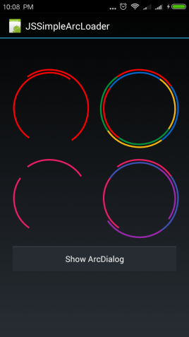
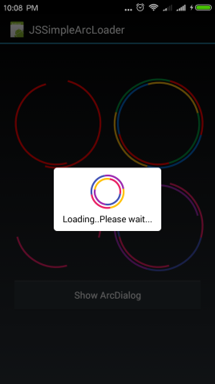

# B4A-JSSimpleArcLoader
[SimpleArcLoader](https://github.com/generic-leo/SimpleArcLoader) wrapped for B4A (Basic4Android)

==Copy .aar, .jar, .xml to your additional library folder==

 

### Sample
###### ArcDialog Sample
```
'create configuration
Dim config As JSArcConfiguration
config.Initialize
config.setLoaderStyle(config.STYLE_COMPLETE_ARC) _
    .setColors(Array As Int(0xFFE91E63, 0xFF3F51B5, 0xFF9C27B0, 0xFFFFC107, 0xFFF44336, 0xFF4CAF50, 0xFF03A9F4)) _
    .setText("Loading..Please wait...")

'create arc dialog
Dim dlg As JSSimpleArcDialog
dlg.Initialize2("dlg", config)
dlg.Show2(config, True)				
```

###### ArcLoader Sample
```
Dim arc1 As JSSimpleArcLoader	
arc1.Initialize
Activity.AddView(arc1, left, top, size, size)

' or with custom configuration
Dim config As JSArcConfiguration
config.Initialize
config.setLoaderStyle(config.STYLE_COMPLETE_ARC)
'
arc1.refreshArcLoaderDrawable(config)
Activity.AddView(arc1, left, top, size, size)

```

### Acknowledgement
* SimpleArcLoader - https://github.com/generic-leo/SimpleArcLoader

